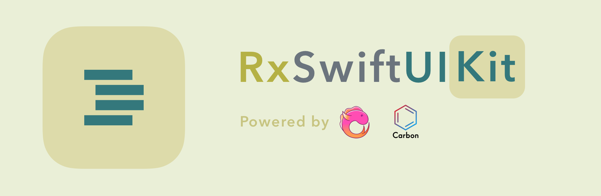
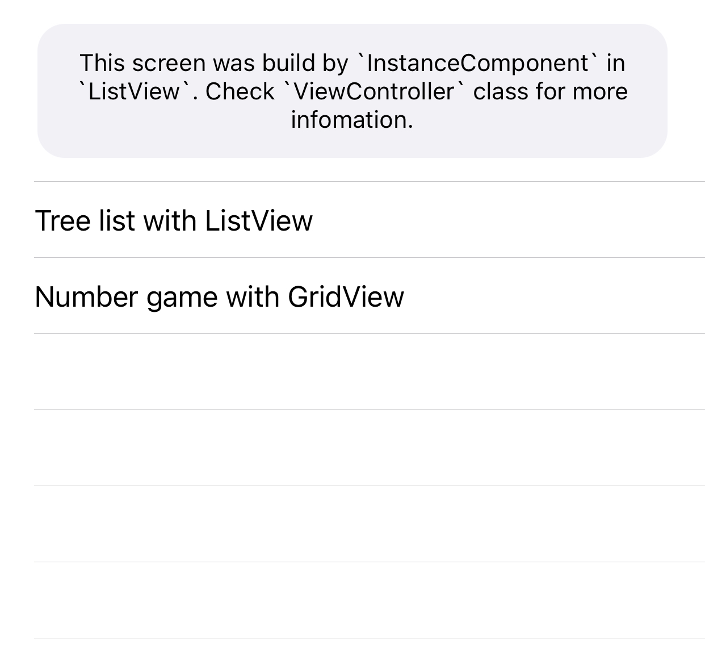

<br/>

[](#Required)
[](#Development%20Progress)
[](#Development%20Progress)

# RxSwiftUIKit

**RxSwiftUIKit** is an extension of [SwiftUIKit](https://github.com/sonla58/SwiftUIKit). Combine with [RxSwift](https://github.com/ReactiveX/RxSwift) and [Carbon](https://github.com/ra1028/Carbon), tt gives us the ability to build the tableView or collectionView using the declarative way.



```swift
ListView(style: .plain, reloadTriggers: [self.items.map { _ in Void() }]) {
    InstanceComponent(identifier: 0) { (_) in
        ZStackView {
            UILabel()
                .dx.text("This screen was build by `InstanceComponent` in `ListView`. Check `ViewController` class for more infomation.")
                .dx.font(UIFont.systemFont(ofSize: 14, weight: .regular))
                .dx.numberOfLines(0)
                .dx.textAlignment(NSTextAlignment.center)
                .stickingToParentEdges(left: 16, right: 16, top: 14, bottom: 14)
        }
        .dx.style(SimpleCard())
        .fillingParent(insets: (22, 22, 14, 14))
    }
    
    Group(of: self.items.value) { (item: Item) in
        InstanceComponent(identifier: item.0) { (i) in
            ZStackView {
                UILabel()
                    .dx.text(i)
                    .stickingToParentEdges(left: 20, right: .greaterThanOrEqualTo(20), top: 12, bottom: 12)
                UIButton()
                    .dx.useRx(withUnretained: self, disposeBag: self.disposeBag, reactiveBlock: { (owner, base: UIButton) in
                        base.rx.tap
                            .bind { (_) in
                                item.1()
                            }
                    })
                    .fillingParent()
            }
            .fillingParent()
        }
    }
}
```

# Requirement

- iOS 11+
- XCode 11+
- Swift 5.3+

# Installation

## CocoaPods

Add following line to your project's Podfile
```ruby
pod 'RxSwiftUIKit', '1.0.0'
```
Run `pod install` to install SwiftUIKit

## Source Code

Drop all files in folder `./RxSwiftUIKit/Source` to your project or download this repo and drag `RxSwiftUIKit.xcodeproj` to your project with necessary files then link your app with `SwiftUIKit` framework munualy

# Usage

## Layout

To build layout with Declarative way using LayoutBuilder, read [SwiftUIKit](https://github.com/sonla58/SwiftUIKit)

## Component

**Component** is a unit of the UI in [Carbon](https://github.com/ra1028/Carbon) to build UITableView or UICollectionView. Please read more document of Carbon here: [Carbon Document]([Carbon](https://github.com/ra1028/Carbon))

Build Component

```swift
struct BasicComponemt: Component {
    let title: String
    let onTap: () -> Void

    func renderContent() -> BasicView {
        BasicView()
    }

    func render(in content: BasicView) {
        content.title = title
        content.onTap = onTap
    }
}

class BasicView: UI.View {

    let title: String
    let onTap: () -> Void = { }

    override var subviewsLayout: SomeView {
        ZStackView {
            UILabel()
                .dx.text(title)
                .stickingToParentEdges(left: 20, right: .greaterThanOrEqualTo(20), top: 12, bottom: 12)
            UIButton()
                .dx.useRx(withUnretained: self, 
                          disposeBag: self.disposeBag, 
                          reactiveBlock: { (owner, base: UIButton) in
                            base.rx.tap
                                .bind { (_) in
                                    owner.onTap()
                                }
                })
                .fillingParent()
        }
        .fillingParent()
    }
}
```

or you can use `InstanceComponent` to build basic component with LayoutBuilder

```swift
InstanceComponent(identifier: id) { (id) in
    ZStackView {
        UILabel()
            .dx.text(id)
            .stickingToParentEdges(left: 20, right: .greaterThanOrEqualTo(20), top: 12, bottom: 12)
        UIButton()
            .dx.useRx(withUnretained: self,
                      disposeBag: self.disposeBag,
                      reactiveBlock: { (owner, base: UIButton) in
                        base.rx.tap
                            .bind { (_) in
                                print(id)
                            }
            })
            .fillingParent()
    }
    .fillingParent()
}
```

## ListView

```swift
let list = BehaviorRelay<[String]>(value: [
    "Bún Đậu",
    "Phở",
    "Mắm tôm"
])

ListView(style: .plain, reloadTriggers: [self.list.map { _ in Void() }]) {
    Group(list) { item in
        BasicComponent(title: item) {
            print(item)
        }
    }
}
.fillingParent()
```

`reloadTriggers` is an array of `Observable<Void>`, when one of triggers receive `next` event, listView will be reload data automatically.

## GridView

```swift
let list = BehaviorRelay<[String]>(value: [
    "Bún Đậu",
    "Phở",
    "Mắm tôm"
])

GridView(reloadTriggers: [self.list.map { _ in Void() }]) {
    Group(list) { item in
        BasicComponent(title: item) {
            print(item)
        }
    }
}
.fillingParent()
```

This is a basic example of usage GridView with default layout: `UICollectionViewFlowLayout` and default `Renderer`. Read Complex example in [Carbon](https://github.com/ra1028/Carbon)